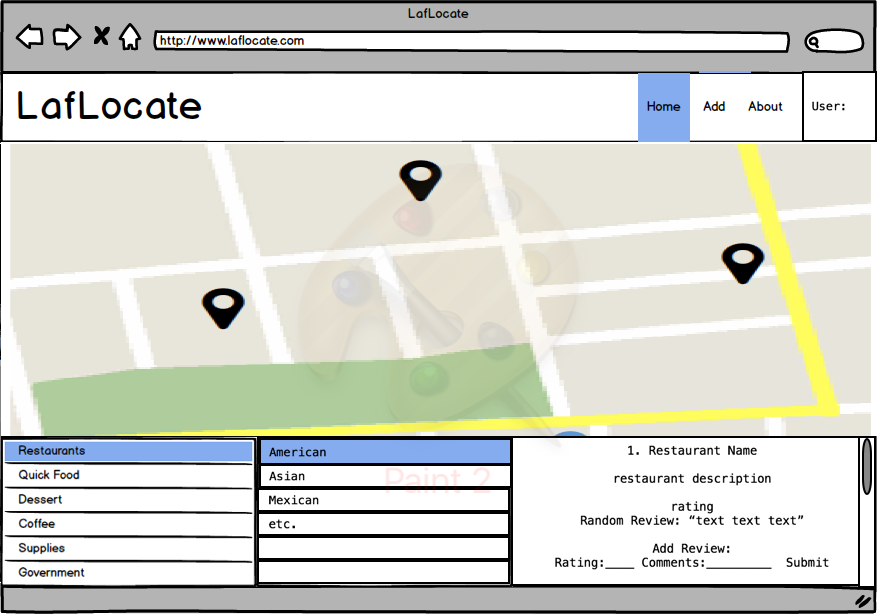
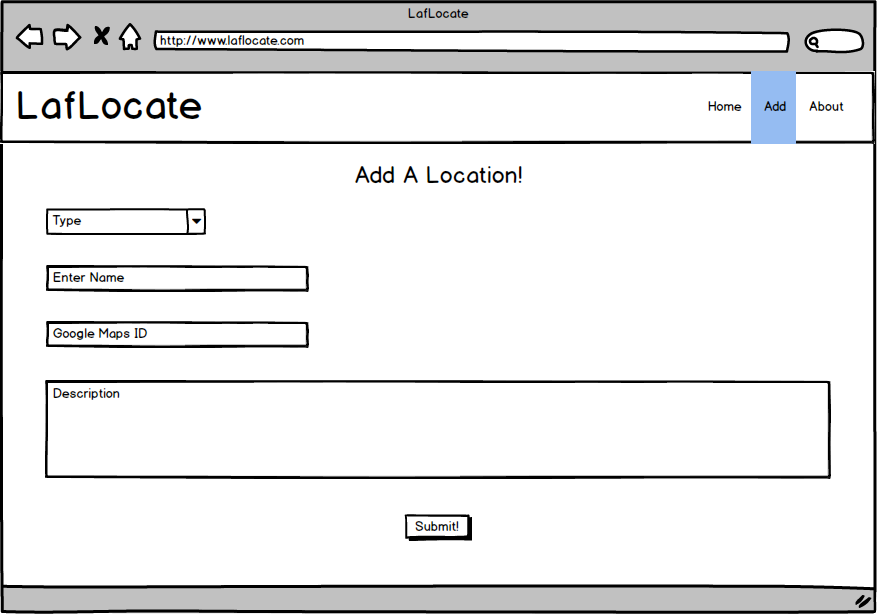
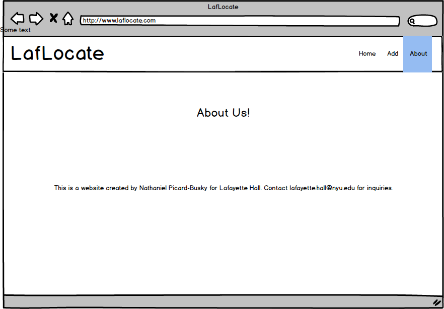
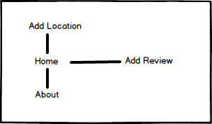

# LafLocate

## Overview

As an RA at NYU's Lafayette Hall, one of the farthest residence halls from campus, I get a lot of questions about the best places to eat and shop around the Chinatown and Lafayette Hall area. There is a long list of places that have been vetted by RAs and staff over the years that past muster for reasons other than those commonly rated on recommendation apps like Yelp.

LafLocate is a web app that will allow users to browse a list of locations around the area that have been approved by their peers, college students just like them. Users must login with their NYU email to confirm that they are Lafayette Hall residents. Once they have logged in, users can view the full list of locations and filter the results to find the location that they're looking for. Users can also review locations and suggest new locations to be added to the database.


## Data Model

(Describe the documents that you'll be storing - assuming that you're using a document based NoSQL database, like mongoose ... this can be in the form of commented plain JavaScript objects or an _actual_ Mongoose schema)

Minimally, we'll have to store Users, Locations, and Reviews

* Reviews have an associated Location
* Users can create, filter, and view locations and reviews

First draft schema:

```javascript
// users
// * our site requires authentication...
// * so users have a username and password
// 
var User = new mongoose.Schema({
  // username, password provided by plugin
});

// a location
// * contains Google pin info to be served to the map
// * rating can be updated
//  
var Location = new mongoose.Schema({
  name: {type: String, required: true},
  type: {type: String, required: true},
  category: {type: String, required: true},
  rating: {type: Number, default: 0, required: true},
  rating_disp: {type: Number, default: 0, required: true},
  rating_cnt: {type: Number, default: 0, required: true},
  lat: {type: Number, required: true},
  lng: {type: Number, required: true},
  desc: {type: String},
}, {
  _id: true
});

// a review
// * each list must have a related location
// * each review is initiated unchecked upon submission, admins can go in and check new reviews
var Review = new mongoose.Schema({
  location: {type: mongoose.Schema.Types.ObjectId, ref:'Location'},
  createdBy: {type: String, required: true},
  createdAt: {type: Date, required: true},
  content: {type: String, required: true},
  // so that the admins can assure reviews displayed are appropriate and useful
  checked: {type: Boolean, default: false, required: true}
});
```

## Wireframes

(these are html mockups for wireframes, though they can be created using wireframing tools or even hand-drawn)

/ - homepage



/add-location - page for adding a location



/about - page for showing information about the site



## Site map

Add site map here

Here's a [complex example from wikipedia](https://upload.wikimedia.org/wikipedia/commons/2/20/Sitemap_google.jpg), but you can create one without the screenshots, drop shadows, etc. ... just names of pages and where they flow to.



## User stories

1. as a user, I can filter locations and view them and their related info on a map
2. as a user, I can rate and review locations
3. as a user, I can view information about the site
4. as a user, I can add a location to the database of locations

## Research Topics

* (5 points) Integrate user authentication
    * I'm going to be using passport for user authentication
    * see <code>i6.cims.nyu.edu:17876/register</code> for register page
    * see <code>i6.cims.nyu.edu:17876/login</code> for login page
* (5 points) Integrate Google Maps API to populate map
    * Each location includes a Google Maps location ID
    * map refreshes each time a filter is selected

